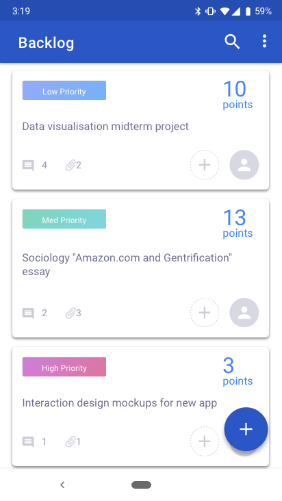
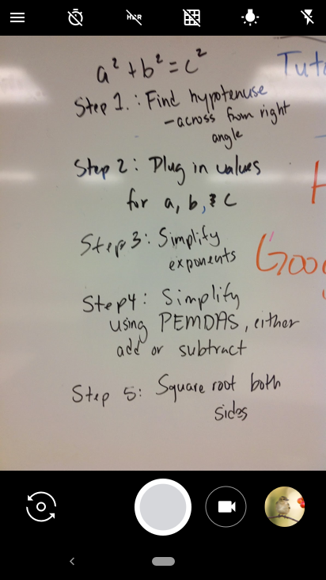
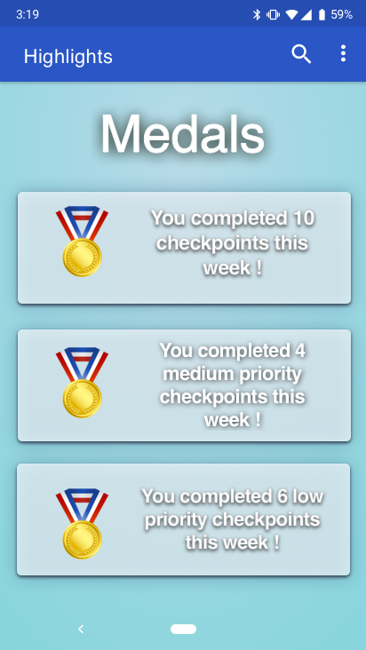
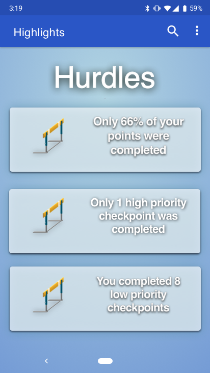
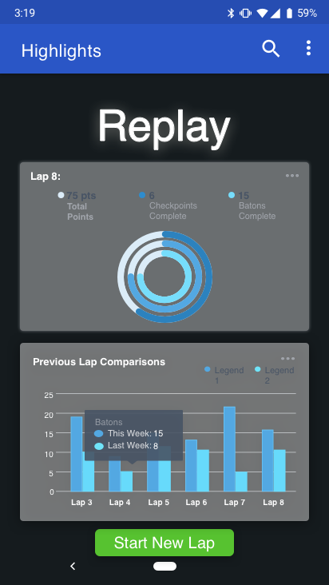

# On Track

Not just another task management app.

## Table of Contents
1. [Overview](#Overview)
1. [Product Spec](#Product-Spec)
1. [Wireframes](#Wireframes)
2. [Schema](#Schema)

## Overview
### What is OnTrack?
OnTrack is an app for students looking to increase their daily focus and drive by making their productivity more tangible, inspired by Scrum, an Agile project management framework engineers use to address complex problems.

### App Evaluation
- **Category:** Task Management
- **Mobile:** This app uses the camera and real-time push notifications.
- **Story:** By helping students keep track of their completed and desired accomplishments, this app helps students maintain high morale, motivation, and work-life balance.
- **Market:** This app is geared toward college students who hope to be more productive, and who feel they have trouble keeping themselves motivated.
- **Habit:** This app would be used daily as a way to keep users focused and motivated in their tasks.
- **Scope:** 

## Product Spec

### 1. User Stories (Required and Optional)

**Required Must-have Stories**

* Database keeping track of users, checkpoints (high-level tasks), and batons (lower-level breakdown of tasks)
* Push notifications for reminders to complete tasks
* Camera to add photos to checkpoints
* Create data visualisations of completed tasks

**Optional Nice-to-have Stories**

* Location-tracking
* Social connection
* Send baton as a way to collaborate with another user
* Alert of a new baton comming in
* See friend's profile
* Compare completed batons

### 2. Screen Archetypes

* Login
    * User logs in to existing account
    * App remembers previous log in and persists the user until log out
* Register
    * User signs up for an account
* [list second screen here]
   * [list associated required story here]
   * ...

### 3. Navigation

**Tab Navigation** (Tab to Screen)

* [fill out your first tab]
* [fill out your second tab]
* [fill out your third tab]

**Flow Navigation** (Screen to Screen)

* [list first screen here]
   * [list screen navigation here]
   * ...
* [list second screen here]
   * [list screen navigation here]
   * ...

## Wireframes

### Original App Storyboard

### Digital Wireframes & Mockups

## Schema 
[This section will be completed in Unit 9]
### Models
[Add table of models]
### Networking
- [Add list of network requests by screen ]
- [Create basic snippets for each Parse network request]
- [OPTIONAL: List endpoints if using existing API such as Yelp]