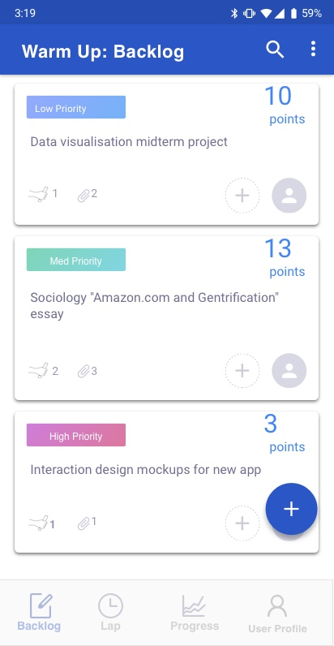
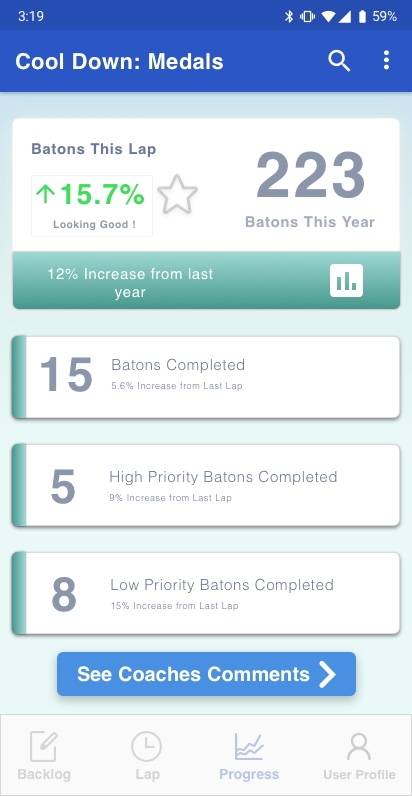

# OnTrack

Not just another task management app.

## Table of Contents
1. [Overview](#Overview)
1. [Product Spec](#Product-Spec)
1. [Wireframes](#Wireframes)
2. [Schema](#Schema)

## Overview
### What is OnTrack?
OnTrack is an app for students looking to increase their daily focus and drive by making their productivity more tangible, inspired by Scrum, an Agile project management framework engineers use to address complex problems.


### App Evaluation
- **Category:** Task Management
- **Mobile:** This app uses the camera and real-time push notifications.
- **Story:** By helping students keep track of their completed and desired accomplishments, this app helps students maintain high morale, motivation, and work-life balance.
- **Market:** This app is geared toward college students who hope to be more productive, and who feel they have trouble keeping themselves motivated.
- **Habit:** This app would be used daily as a way to keep users focused and motivated in their tasks.
- **Scope:** First we would start with students tracking their own tasks. We would then add functionality to add attachments to tasks in order to track relevant documents and information. We would then add capability for users to share batons (tasks) with others in order to collobarate with them. That would then include the ability to track batons that have been passed on. In the long run, it would be great to expand the user base beyond college students.

## Product Spec

### 1. User Stories

**Required Must-have Stories**

- [x] Database keeping track of users, checkpoints (high-level tasks), and batons (lower-level breakdown of tasks)
- [x] Backlog to hold laps created
- [ ] Push notifications for reminders to complete tasks
- [ ] Camera to add photos to checkpoints
- [ ] Create data visualisations of completed tasks

**User Stories completed**
- [x] User is able to sign up and login
- [x] User is able to nagivate through different fragments 
- [x] User profile can be seen in the login Fragment
- [x] User can see all the batons created in the backlog Fragment
- [x] User is able to add batons in the lap Fragment

**Optional Nice-to-have Stories**

- [ ] Location-tracking
- [ ] Social connection
- [ ] Send baton as a way to collaborate with another user
- [ ] Alert of a new baton coming in
- [ ] See friend's profile
- [ ] Compare completed batons

## Gif Walkthrough

Here's a walkthrough of implemented user stories:


### 2. Screen Archetypes

* Login
    * User logs in to existing account
    * App remembers previous log in and persists the user until log out
* Register
    * User signs up for an account
* Add checkpoints to backlog
   * Keep track of high level tasks that need to be done
* Add batons to checkpoint
   * Break down large task to smaller, more feasible batons and add a weight to each of them
* Attach files to checkpoint
    * Using camera or phone file system, attach relevant files to checkpoint
* Initialize lap
    * Set lap length and preferences
* This lap
   * See incomplete checkpoints for lap in progress
* Lap time
    * See relevant stats for lap in progress
* Highlights
    * See visualisations of how well the user did in this lap
    * Allow user to do a retro where they reflect on:
        * Successful actions in this lap
        * Areas in which they can improve
        * Hurdles they ran into

### 3. Navigation

**Tab Navigation** (Tab to Screen)

* Checkpoint Backlog
    * all high level tasks to be completed
* This Lap
    * all low-level tasks user chose to complete this lap
* Lap Time
    * relevant stats for lap in progress

**Flow Navigation** (Screen to Screen)

* Checkpoint Backlog
    * Add checkpoints to backlog
    * Add batons to checkpoint
    * Attach files to checkpoint
* Batons
    * Add attachments
    * Send baton to another user to collaborate
* Lap Time
    * This lap
    * Complete lap
* Highlights
    * Do a retro
    * Start again


## Wireframes


### Original App Storyboard


### Digital Wireframes & Mockups






## Schema 


## Models
# User 
| Property Name | Type | Description  |
| :---         |     :---:      |          ---: |
| ObjectID PK  | String   | Main ID of user to be used Throughout the App    |
| username     | String       | Username      |
| password     | String       | password      |
| Email     | String       | The user Email      |


# UserProfile
| Property Name | Type | Description  |
| :---         |     :---:      |          ---: |
| ObjectID PK	| String	| Unique ID for user Profile |
| user FK	| Pointer	| Used to link the UserProfie to the user |
| FirstName	| String	| The users first name |
| LastName	| String	| The users last name |
| About	| String	| Information about the user |
| Title	| String	 | what are the user's occupation  |
| TaskCompleted	| Number	 |Number of Laps the user has Completed |
| Points	| Number	| Total number of points earned by the user |
| ProfilePic	 | File	  | user Profile Pic |


# BackLog
| Property Name | Type | Description  |
| :---         |     :---:      |          ---: |
| ObjectID PK	| String |	Unique ID for BackLog used to connect Lap |
| user FK	| Pointer |	Used to link the BackLog to the user |
| NumOfTask	| Number |	Number of Laps currently in the BackLog |
| NumOfCompleted	| Number |	Number of Laps Completed |


# Lap
| Property Name | Type | Description  |
| :---         |     :---:      |          ---: |
| ObjectID PK |	String |	Unique ID for Lap used to connect LapFile and Baton |
| BackLog |	Pointer |	Used to link the Lap to the BackLog | 
| Name |	String |	Lap name |
| Description |	String |	Description of what the lap is about |
| Priority |	String |	The level of importance of the lap |
| BatonCount |	Number |	Numbe of batons in the lap |
| BatonCompleted |	Number |	Number of Batons Completed |
| TotalPoints |	Number | The total amount of points the user can earn in the lap |
| FileCount |	Number |	The number of files attached to the Lap |
| DateSet |	Date |	The amount of time to complete the lap |
| Completed | 	Boolean |	Used to know if the lap has been completed |


# LapFile
| Property Name | Type | Description  |
| :---         |     :---:      |          ---: |
| ObjectID PK	| String |	Unique ID for LapFile |
| Lap FK	| Pointer |	Used to link the LapFile to the Lap |
| Image	| File |	Contains the Image |


# Baton
| Property Name | Type | Description  |
| :---         |     :---:      |          ---: |
| ObjectID PK |	String |	Unique ID for Baton |
| Lap FK |	Pointer |	Used to link the Baton to the Lap |
| Name |	String |	Name of the baton |
| Description |	String |	Describe what the objective is |
| Priority |	String |	The level of importance of the baton |
| Points |	Number |	Number of points the baton contains |
| Completed | 	Boolean |	Used to know if the baton has been completed |


## Networking

#### List of network requests by screen
   - BackLog Feed Screen
      - (Read/GET) Query all laps of user in the backlog
         ```swift
        ParseQuery<BackLog> parseQuery = new ParseQuery<>(BackLog.class);
        parseQuery.include(BackLog.KEY_USER);
        parseQuery.whereEqualTo(BackLog.KEY_USER, ParseUser.getCurrentUser());
        parseQuery.findInBackground(new FindCallback<BackLog>() {
            @Override
            public void done(List<BackLog> ParsedItems, ParseException e) {
                if(e != null) {
                    Log.e("XPARSE", "ERRROR");
                    e.printStackTrace();
                    return;
                }
                //Get Data
            }
        });
         ```
      - (Create/POST) Create a new lap
      - (Delete) Delete Lap
      - (GET) Get number of laps and number of completed laps
      
   - Create Lap Screen
      - (Create/POST) Create a new lap object
        ```swift
        ParseQuery<Lap> parseQuery = new ParseQuery<>(Lap.class);
        parseQuery.include(Lap.KEY_BACKLOG);
        parseQuery.whereEqualTo(Lap.KEY_BACKLOG, getCurrentBackLog());
        parseQuery.findInBackground(new FindCallback<Lap>() {
            @Override
            public void done(List<Lap> ParsedItems, ParseException e) {
                if(e != null) {
                    Log.e("XPARSE", "ERRROR");
                    e.printStackTrace();
                    return;
                }
                //Get Data
            }
        });
        ```
      - (Create/POST) Create name/points/description/etc////
      - (GET) Get data and update the screen       
        
   - Lap Screen
      - (GET) get lap object data
        ```swift
        ParseQuery<Lap> parseQuery = new ParseQuery<>(Lap.class);
        parseQuery.include(Lap.KEY_BACKLOG);
        parseQuery.whereEqualTo(Lap.KEY_BACKLOG, getCurrentBackLog());
        parseQuery.findInBackground(new FindCallback<Lap>() {
            @Override
            public void done(List<Lap> ParsedItems, ParseException e) {
                if(e != null) {
                    Log.e("XPARSE", "ERRROR");
                    e.printStackTrace();
                    return;
                }
                //Get Data
            }
        });
        ```
      - (PUT) Update Data of Lap Description/Priority/etc...
      - (DELETE) Delete Lap/File   
        
   - Progress Screen
      - (GET) get UserProfile object data such as TotalPoints/IncompletedBatons/CompletedBaton
        ```swift
        ParseQuery<UserProfile> parseQuery = new ParseQuery<>(UserProfile.class);
        parseQuery.include(UserProfile.KEY_USER);
        parseQuery.whereEqualTo(UserProfile.KEY_USER, ParseUser.getCurrentUser());
        parseQuery.findInBackground(new FindCallback<UserProfile>() {
            @Override
            public void done(List<UserProfile> ParsedItems, ParseException e) {
                if(e != null) {
                    Log.e("XPARSE", "ERRROR");
                    e.printStackTrace();
                    return;
                }
                //Get Data
            }
        });
        ```


